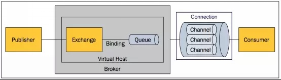

# AMQP协议分析

## 参考文档
1. https://www.rabbitmq.com/tutorials/amqp-concepts.html,中文参考地址:https://www.cnblogs.com/xiaochengzi/p/6895126.html
2. [amqp0-9-1.pdf](amqp0-9-1.pdf),原文档地址https://www.rabbitmq.com/resources/specs/amqp0-9-1.pdf，中文参考地址：http://www.blogjava.net/qbna350816/archive/2016/08/12/431554.html
3. 先大概浏览一遍，在分析源码的过程中再回头看看，这样比较容易理解
4. https://www.rabbitmq.com/amqp-0-9-1-reference.html

## 基本概念

1. AMQP协议模型
  
2. 在线学习rabbitmq的网站 http://tryrabbitmq.com
3. AMQP使用`Class`和`Method`在客户端与服务端之间创建公共语言,`Class`和`Method`被称为`AMQP COMMAND`

