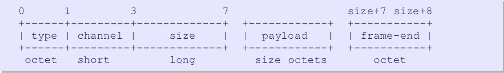
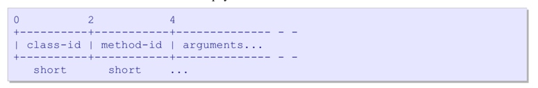
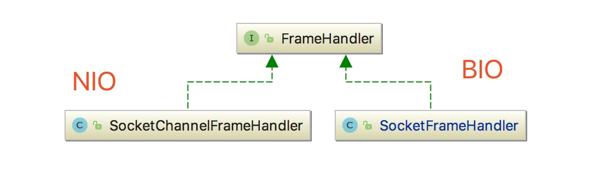
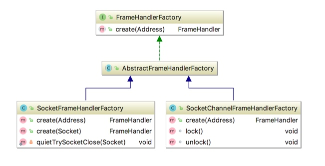

[TOC]

# Frame分析
1. 源码中文注释参考[Frame.java]( ../rabbitmq-java-client/src/main/java/com/rabbitmq/client/impl/Frame.java)

## AMQP帧(Frame)的格式
1. tcp/ip是一个流协议，amqp没有采用在流中添加帧定界符来区分帧数据（原因官方认为简单，但是很慢），而是采用在`header`中写入帧大小来区分不同的帧（官方认为简单而且很快）。
2. 帧就是传输协议的具体实现,即传输的具体数据包
	* 帧类型 通道编号 帧大小 内容 结束标记
	
3. 从上面可以看到读取一个Frame，大概要实现的逻辑
    * 第一步:读取`header`，检查Frame的类型(1,2,3,8四种类型,[AMQP.java](../rabbitmq-java-client/src/main/java/com/rabbitmq/client/AMQP.java)类中定义)和通道编号
    * 第二步:根据帧的类型(type)和payload的长度(size)来读取指定大小的payload进行处理
    * 第三步:读取最后一个字节。
    * 从上面的三步骤来看其实就是在做自定义协议解析的工作，不只是针对AMQP，其实自己定义的协议很多时候也是这么做的。
4.  AMQP协议定义了五种类型的帧:`协议头帧`、`方法帧`、`内容头帧`、`消息体帧`、`心跳帧`

    
## method Frame的payload
1. 一个方法帧携带一个命令，方法帧payload有下面的格式 


## Content Frame
1. 内容头帧包含一条消息的大小和属性

## Body Frame


## Frame源码分析
1. 帧属性
    
    ```java
    public class Frame {
        /** Frame type code */
        public final int type;
    
        /** Frame channel number, 0-65535 通道编号，一个TCPIP连接，多个通道，每个通道都有自己的编号*/
        public final int channel;
    
        /** Frame payload bytes (for inbound frames) 有效载荷,就是除了协议头之外的内容*/
        private final byte[] payload;
    
        /** Frame payload (for outbound frames) 字节流的累加器，用于*/
        private final ByteArrayOutputStream accumulator;
    
        /**
         * 自定义协议都是 【协议头】+【协议体】,NON_BODY_SIZE指的是没有协议体内容的情况下最小的传输
         * 长度。从这里可以看出【协议头】=type(1B)+channel(2B)+payloadSize(4B)+1(1B),总共占用8B(8个字节)
         */
        private static final int NON_BODY_SIZE = 1 /* type */ + 2 /* channel */ + 4 /* payload size */ + 1 /* end character */;
            
    }

    ```
2. 帧方法
    
    ```java
    public static Frame readFrom(DataInputStream is) throws IOException {
        int type;
        int channel;

        try {
            //读取1B
            type = is.readUnsignedByte();
        } catch (SocketTimeoutException ste) {
            // System.err.println("Timed out waiting for a frame.");
            return null; // failed
        }

        if (type == 'A') {
            /*
             * Probably an AMQP.... header indicating a version
             * mismatch.
             */
            /*
             * Otherwise meaningless, so try to read the version,
             * and throw an exception, whether we read the version
             * okay or not.检查协议版本
             */
            protocolVersionMismatch(is);
        }
        //读取2B
        channel = is.readUnsignedShort();
        //读取4B
        int payloadSize = is.readInt();
        //构造存放内容的字节数组
        byte[] payload = new byte[payloadSize];
        /**
         *  readFully数据缓冲区的空间还有剩余时会阻塞等待读取，直到装满。
         *  此处不能使用is.read(payload),
         *  read(byte[] b)一直阻塞等待读取字节，直到字节流中的数据已经全部读完。
         *  而readFully(byte[] b)是当数据缓冲区的空间还有剩余时会阻塞等待读取，直到装满。
         */

        is.readFully(payload);

        int frameEndMarker = is.readUnsignedByte();
        //如果读取完body之后最后一个字节不是结束帧，就代表数据格式不正确，以此来判断Frame的正确性
        if (frameEndMarker != AMQP.FRAME_END) {
            throw new MalformedFrameException("Bad frame end marker: " + frameEndMarker);
        }

        return new Frame(type, channel, payload);
    }
    ```

## FrameHandler
1. UML图

2. rabbitmq-java-client(4.0.3)版本提供了两种处理模式，`NIO`和`BIO`

### SocketFrameHandler
1. 原生socket处理方式,代码详细分析参考[SocketFrameHandler](../rabbitmq-java-client/src/main/java/com/rabbitmq/client/impl/nio/SocketChannelFrameHandler.java)


## FramehandlerFactory
1. uml图


2. 接口方法
   
    ```java
    public interface FrameHandlerFactory {
    
        FrameHandler create(Address addr) throws IOException;
    
    }
    ```

### AbstractFrameHandlerFactory
1. [AbstractFrameHandlerFactory](../rabbitmq-java-client/src/main/java/com/rabbitmq/client/impl/AbstractFrameHandlerFactory.java)源码
    
    ```java
       public abstract class AbstractFrameHandlerFactory implements FrameHandlerFactory {
    
        //连接超时时间
        protected final int connectionTimeout;
        //socket选项，此SocketConfigurator接口目前只有一个实现类DefaultSocketConfigurator
        protected final SocketConfigurator configurator;
        //是否ssl
        protected final boolean ssl;
    
        protected AbstractFrameHandlerFactory(int connectionTimeout, SocketConfigurator configurator, boolean ssl) {
            this.connectionTimeout = connectionTimeout;
            this.configurator = configurator;
            this.ssl = ssl;
        }
    }    
   ```
2. [DefaultSocketConfigurator ](../rabbitmq-java-client/src/main/java/com/rabbitmq/client/DefaultSocketConfigurator.java)源码
    
    ```java
        public class DefaultSocketConfigurator implements SocketConfigurator {
        @Override
        public void configure(Socket socket) throws IOException {
            // disable Nagle's algorithm, for more consistently low latency
            /**
             * 禁用Nagle算法，默认这里只是设置了一个socket选项，我们完全可以自己定义自己想要设置的socket选项
             * 传输给ConnectionFactory。比如我们可以设置SO_LINGER选项来进行延迟关闭连接.事实上在SocketFrameHandler类
             * 中close方法就设置了setSoLinger();
             */
    
    
            socket.setTcpNoDelay(true);
        }
    }

    ```
    
### SocketFrameHandlerFactory
1.  源码
    
    ```java
        public class SocketFrameHandlerFactory extends AbstractFrameHandlerFactory {
    
        private final SocketFactory factory;
        //用于关闭socket的线程池
        private final ExecutorService shutdownExecutor;
    
        public SocketFrameHandlerFactory(int connectionTimeout, SocketFactory factory, SocketConfigurator configurator, boolean ssl) {
            this(connectionTimeout, factory, configurator, ssl, null);
        }
    
        public SocketFrameHandlerFactory(int connectionTimeout, SocketFactory factory, SocketConfigurator configurator, boolean ssl, ExecutorService shutdownExecutor) {
            super(connectionTimeout, configurator, ssl);
            this.factory = factory;
            this.shutdownExecutor = shutdownExecutor;
        }
    
        public FrameHandler create(Address addr) throws IOException {
            String hostName = addr.getHost();
            int portNumber = ConnectionFactory.portOrDefault(addr.getPort(), ssl);
            Socket socket = null;
            try {
                //通过socketFactory创建Socket
                socket = factory.createSocket();
                //设置socket选项
                configurator.configure(socket);
                //开启连接
                socket.connect(new InetSocketAddress(hostName, portNumber),
                        connectionTimeout);
                return create(socket);
            } catch (IOException ioe) {
                quietTrySocketClose(socket);
                throw ioe;
            }
        }
    
        public FrameHandler create(Socket sock) throws IOException
        {
            return new SocketFrameHandler(sock, this.shutdownExecutor);
        }
    
        private static void quietTrySocketClose(Socket socket) {
            if (socket != null)
                try { socket.close(); } catch (Exception _e) {/*ignore exceptions*/}
        }
    }

    ```   
    
### SocketChannelFrameHandlerFactory
1. TODO待续......    

