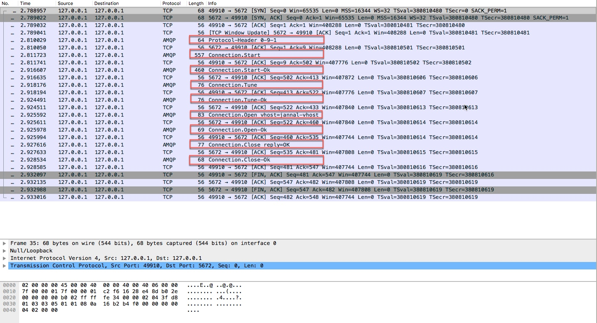
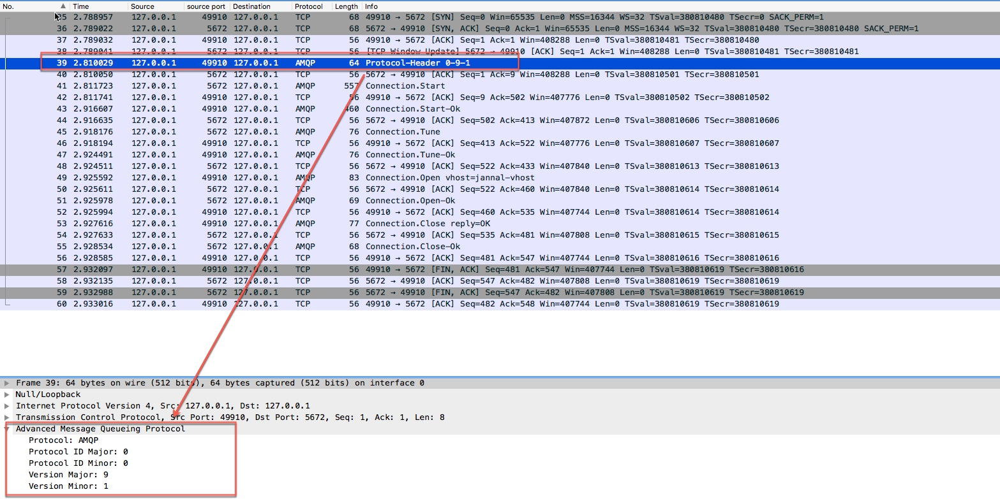
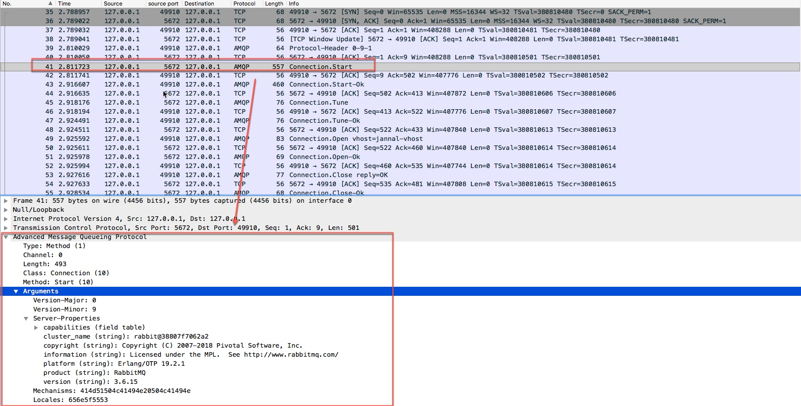
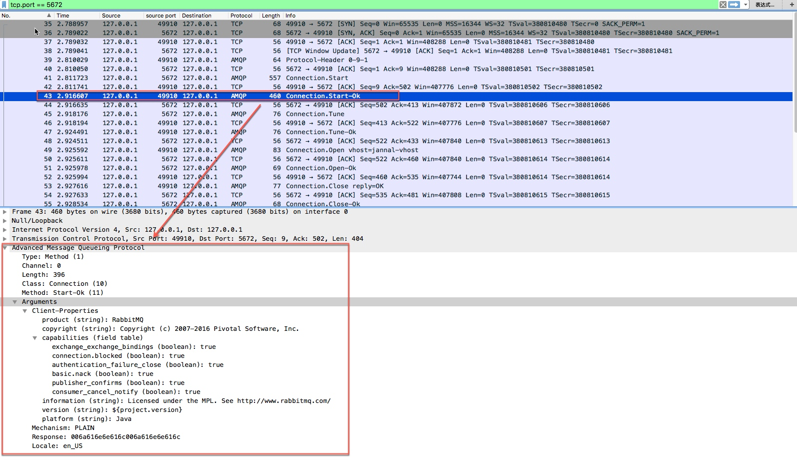
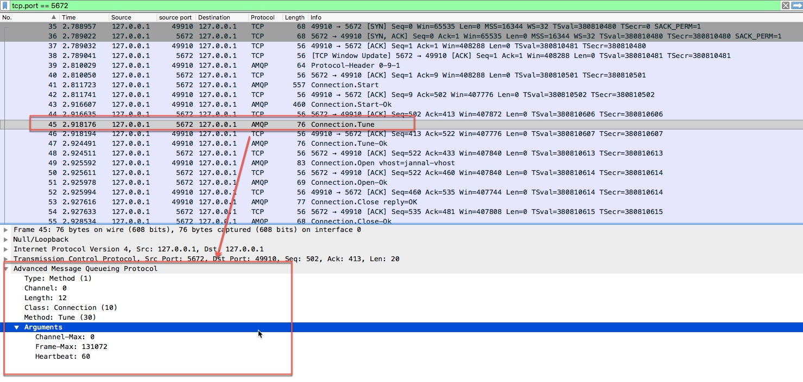
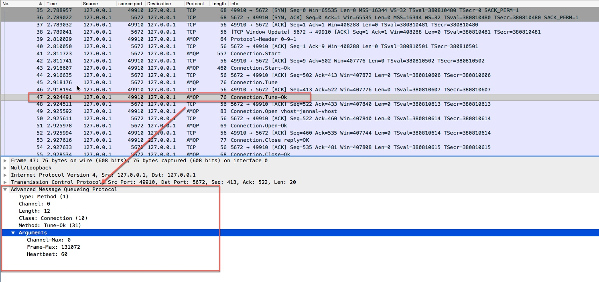
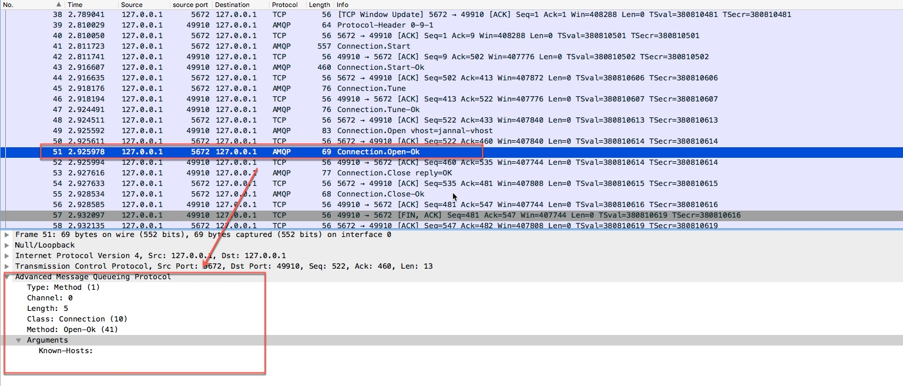
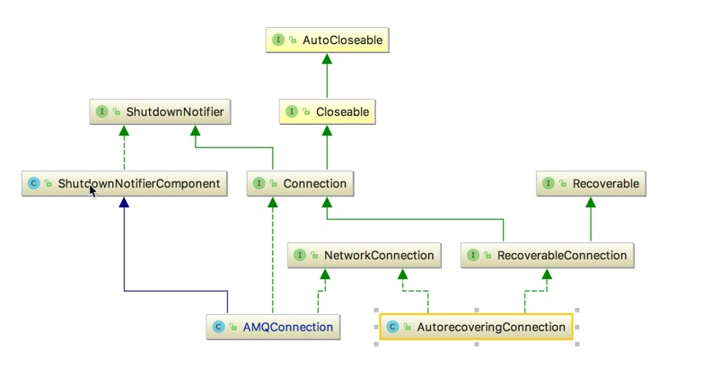
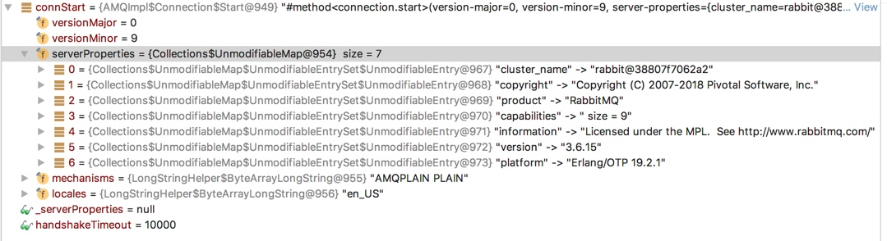

[TOC]

# Connection
1. 这里的连接其实就表示的是TCP/IP socket连接，一个`Connection`有多个`Channel`,意味`Connection`会被设计为长连接，并且每个Channel一定有一个唯一标识，客户端请求和服务端响应都会携带这个标识，以区分是哪个通道。


## 连接过程分析
1. client打开与服务器的TCP/IP连接并发送一个协议头(protocol header).这只是client发送的数据，而不是作为方法格式的数据.
2. server使用其协议版本和其它属性，包括它支持安全机制列表(Start方法)进行响应.
3. client选择一种安全机制(Start-Ok).
4. server开始认证过程, 它使用SASL的质询-响应模型(challenge-response model). 它向客户端发送一个质询(Secure).
5. client向server发送一个认证响应(Secure-Ok). 例如，对于使用"plain"机制,响应会包含登录用户名和密码.
server 重复质询(Secure) 或转到协商,发送一系列参数，如最大帧大小(Tune).
6. client接受或降低这些参数(Tune-Ok).
7. client 正式打开连接并选择一个虚拟主机(Open).
8. 服务器确认虚拟主机是一个有效的选择 (Open-Ok).
9.  客户端现在使用希望的连接.
10. 一个节点(client 或 server) 结束连接(Close).
11. 另一个节点对连接结束握手(Close-Ok).
12. server 和  client关闭它们的套接字连接.


## 连接过程抓包分析
1. 整个连接过程,我们从抓包结果来分析，只关注`AMQP`协议即可



2.  第一步客户端发送`Protocol-Hearder`


3. 服务端响应`Connection.start`


4. 客户端发送`Connection.Start-Ok`

5. 服务端发送`Connection.Tune`

6. 客户端发送`Connection.Tune-Ok`

7. 客户端发送`Connection.Open`

8. 服务端发送`Connection.Open-Ok`



## 源码分析
1. uml图



### ConnectionFactory
1. 创建连接的工厂[ConnectionFactory](../rabbitmq-java-client/src/main/java/com/rabbitmq/client/ConnectionFactory.java),包含创建连接的一些必备参数。
2. 核心方法`newConnection()`
    
    ```java
    public Connection newConnection(ExecutorService executor, AddressResolver addressResolver, String clientProvidedName)
            throws IOException, TimeoutException {
            if(this.metricsCollector == null) {
                //这是一个空的收集，没有任何操作
                this.metricsCollector = new NoOpMetricsCollector();
            }
            // make sure we respect the provided thread factory
            //根据参数创建FrameHandlerFactory，BIO和NIO
            FrameHandlerFactory fhFactory = createFrameHandlerFactory();
            //此executor是用于消费者消费使用的(consumerWorkServiceExecutor)
            ConnectionParams params = params(executor);
            // set client-provided via a client property
            if (clientProvidedName != null) {
                Map<String, Object> properties = new HashMap<String, Object>(params.getClientProperties());
                properties.put("connection_name", clientProvidedName);
                params.setClientProperties(properties);
            }
            //默认自动恢复连接
            if (isAutomaticRecoveryEnabled()) {
                // see com.rabbitmq.client.impl.recovery.RecoveryAwareAMQConnectionFactory#newConnection
                AutorecoveringConnection conn = new AutorecoveringConnection(params, fhFactory, addressResolver, metricsCollector);
    
                conn.init();
                return conn;
            } else {
                List<Address> addrs = addressResolver.getAddresses();
                Exception lastException = null;
                for (Address addr : addrs) {
                    try {
                        FrameHandler handler = fhFactory.create(addr);
                        AMQConnection conn = createConnection(params, handler, metricsCollector);
                        conn.start();
                        this.metricsCollector.newConnection(conn);
                        return conn;
                    } catch (IOException e) {
                        lastException = e;
                    } catch (TimeoutException te) {
                        lastException = te;
                    }
                }
                if (lastException != null) {
                    if (lastException instanceof IOException) {
                        throw (IOException) lastException;
                    } else if (lastException instanceof TimeoutException) {
                        throw (TimeoutException) lastException;
                    }
                }
                throw new IOException("failed to connect");
            }
        }
    ```
    
3. `createFrameHandlerFactory`, `FrameHandlerFactory`详细源码参考`Frame章节`
 
 ```java 
      protected synchronized FrameHandlerFactory createFrameHandlerFactory() throws IOException {
            if(nio) {
                if(this.frameHandlerFactory == null) {
                    if(this.nioParams.getNioExecutor() == null && this.nioParams.getThreadFactory() == null) {
                        this.nioParams.setThreadFactory(getThreadFactory());
                    }
                    this.frameHandlerFactory = new SocketChannelFrameHandlerFactory(connectionTimeout, nioParams, isSSL(), sslContext);
                }
                return this.frameHandlerFactory;
            } else {
                return new SocketFrameHandlerFactory(connectionTimeout, factory, socketConf, isSSL(), this.shutdownExecutor);
            }
    
        }   
    ``` 


### AMQConnection分析

### AutorecoveringConnection 分析


## 启动连接的代码
1. 客户端发送连接请求协议`Start`,服务端响应



