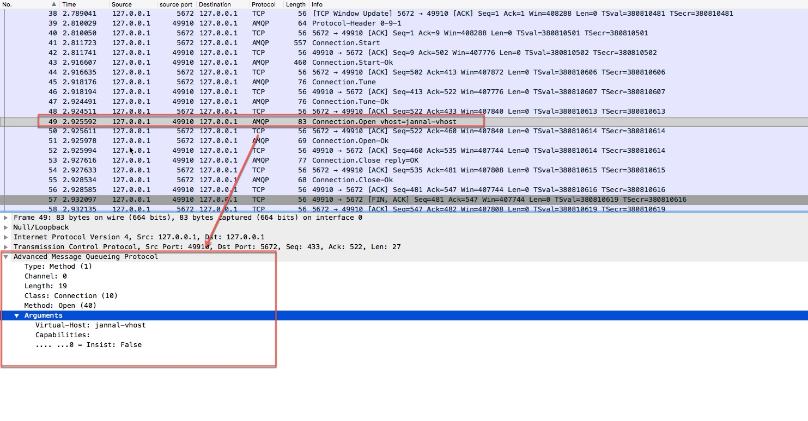

[TOC]

# Connection
1. 这里的连接其实就表示的是TCP/IP socket连接，一个`Connection`有多个`Channel`,意味`Connection`会被设计为长连接，并且每个Channel一定有一个唯一标识，客户端请求和服务端响应都会携带这个标识，以区分是哪个通道。


## 连接过程分析
1. client打开与服务器的TCP/IP连接并发送一个协议头(protocol header).这只是client发送的数据，而不是作为方法格式的数据.
2. server使用其协议版本和其它属性，包括它支持安全机制列表(Start方法)进行响应.
3. client选择一种安全机制(Start-Ok).
4. server开始认证过程, 它使用SASL的质询-响应模型(challenge-response model). 它向客户端发送一个质询(Secure).
5. client向server发送一个认证响应(Secure-Ok). 例如，对于使用"plain"机制,响应会包含登录用户名和密码.
server 重复质询(Secure) 或转到协商,发送一系列参数，如最大帧大小(Tune).
6. client接受或降低这些参数(Tune-Ok).
7. client 正式打开连接并选择一个虚拟主机(Open).
8. 服务器确认虚拟主机是一个有效的选择 (Open-Ok).
9.  客户端现在使用希望的连接.
10. 一个节点(client 或 server) 结束连接(Close).
11. 另一个节点对连接结束握手(Close-Ok).
12. server 和  client关闭它们的套接字连接.


## 连接过程抓包分析
1. 整个连接过程,我们从抓包结果来分析，只关注`AMQP`协议即可


2.  第一步客户端发送`Protocol-Hearder`


3. 服务端响应`Connection.start`


4. 客户端发送`Connection.Start-Ok`

5. 服务端发送`Connection.Tune`

6. 客户端发送`Connection.Tune-Ok`

7. 客户端发送`Connection.Open`

8. 服务端发送`Connection.Open-Ok`


## 源码分析
1. uml图


### ConnectionFactory
1. 创建连接的工厂[ConnectionFactory](../rabbitmq-java-client/src/main/java/com/rabbitmq/client/ConnectionFactory.java),包含创建连接的一些必备参数。
2. 核心方法`newConnection()`
    
    ```java
    
        public Connection newConnection(ExecutorService executor, AddressResolver addressResolver, String clientProvidedName)
                throws IOException, TimeoutException {
                if(this.metricsCollector == null) {
                    //这是一个空的收集，没有任何操作
                    this.metricsCollector = new NoOpMetricsCollector();
                }
                // make sure we respect the provided thread factory
                //根据参数创建FrameHandlerFactory，BIO和NIO
                FrameHandlerFactory fhFactory = createFrameHandlerFactory();
                //此executor是用于消费者消费使用的(consumerWorkServiceExecutor)
                ConnectionParams params = params(executor);
                // set client-provided via a client property
                if (clientProvidedName != null) {
                    Map<String, Object> properties = new HashMap<String, Object>(params.getClientProperties());
                    properties.put("connection_name", clientProvidedName);
                    params.setClientProperties(properties);
                }
                //默认自动恢复连接
                if (isAutomaticRecoveryEnabled()) {
                    // see com.rabbitmq.client.impl.recovery.RecoveryAwareAMQConnectionFactory#newConnection
                    AutorecoveringConnection conn = new AutorecoveringConnection(params, fhFactory, addressResolver, metricsCollector);
        
                    conn.init();
                    return conn;
                } else {
                    List<Address> addrs = addressResolver.getAddresses();
                    Exception lastException = null;
                    for (Address addr : addrs) {
                        try {
                            FrameHandler handler = fhFactory.create(addr);
                            AMQConnection conn = createConnection(params, handler, metricsCollector);
                            conn.start();
                            this.metricsCollector.newConnection(conn);
                            return conn;
                        } catch (IOException e) {
                            lastException = e;
                        } catch (TimeoutException te) {
                            lastException = te;
                        }
                    }
                    if (lastException != null) {
                        if (lastException instanceof IOException) {
                            throw (IOException) lastException;
                        } else if (lastException instanceof TimeoutException) {
                            throw (TimeoutException) lastException;
                        }
                    }
                    throw new IOException("failed to connect");
                }
            }
       
    ```
        
3. `createFrameHandlerFactory`, `FrameHandlerFactory`详细源码参考`Frame章节`
     
     ```java 
       protected synchronized FrameHandlerFactory createFrameHandlerFactory() throws IOException {
                if(nio) {
                    if(this.frameHandlerFactory == null) {
                        if(this.nioParams.getNioExecutor() == null && this.nioParams.getThreadFactory() == null) {
                            this.nioParams.setThreadFactory(getThreadFactory());
                        }
                        this.frameHandlerFactory = new SocketChannelFrameHandlerFactory(connectionTimeout, nioParams, isSSL(), sslContext);
                    }
                    return this.frameHandlerFactory;
                } else {
                    return new SocketFrameHandlerFactory(connectionTimeout, factory, socketConf, isSSL(), this.shutdownExecutor);
                }
        
            }    
    
     ``` 
    
### AMQConnection分析
    
1. [AMQConnection](../rabbitmq-java-client/src/main/java/com/rabbitmq/client/impl/AMQConnection.java)详细注释
2. 起来启动的核心代码

    ```java
         /**
             * Start up the connection, including the MainLoop thread.
             * Sends the protocol
             * version negotiation header, and runs through
             * Connection.Start/.StartOk, Connection.Tune/.TuneOk, and then
             * calls Connection.Open and waits for the OpenOk. Sets heart-beat
             * and frame max values after tuning has taken place.
             * @throws IOException if an error is encountered
             * either before, or during, protocol negotiation;
             * sub-classes {@link ProtocolVersionMismatchException} and
             * {@link PossibleAuthenticationFailureException} will be thrown in the
             * corresponding circumstances. {@link AuthenticationFailureException}
             * will be thrown if the broker closes the connection with ACCESS_REFUSED.
             * If an exception is thrown, connection resources allocated can all be
             * garbage collected when the connection object is no longer referenced.
             *
             *
             * client收到Connection.Tune方法后，必须要开始发送心跳,
             * 并在收到Connection.Open后，必须要开始监控.server在收到Connection.Tune-Ok后，
             * 需要开始发送和监控心跳．
             */
            public void start()
                    throws IOException, TimeoutException {
                //创建Consumer服务
                initializeConsumerWorkService();
                //创建长连接心跳
                initializeHeartbeatSender();
                //判断主循环是否在运行中
                this._running = true;
                // Make sure that the first thing we do is to send the header,
                // which should cause any socket errors to show up for us, rather
                // than risking them pop out in the MainLoop
        
                /**
                 * 先发送header，确保socket是否会发生错误，比在MainLoop(主事件循环)去确保要好。
                 */
                AMQChannel.SimpleBlockingRpcContinuation connStartBlocker =
                    new AMQChannel.SimpleBlockingRpcContinuation();
                // We enqueue an RPC continuation here without sending an RPC
                // request, since the protocol specifies that after sending
                // the version negotiation header, the client (connection
                // initiator) is to wait for a connection.start method to
                // arrive.
                _channel0.enqueueRpc(connStartBlocker);
                try {
                    // The following two lines are akin to AMQChannel's
                    // transmit() method for this pseudo-RPC.
                    _frameHandler.setTimeout(handshakeTimeout);
                    //发送一个协议头开始新的连接，格式为'AMQP0091'
                    _frameHandler.sendHeader();
                } catch (IOException ioe) {
                    _frameHandler.close();
                    throw ioe;
                }
                /**
                 * 此处就是启动MainLoop(源码是 connection.startMainLoop())
                 * 把连接启动放入到framehandler的  initialize()方法中，这样的设计是否合理??
                 */
        
                this._frameHandler.initialize(this);
        
                AMQP.Connection.Start connStart;
                AMQP.Connection.Tune connTune = null;
                try {
                    connStart =
                            (AMQP.Connection.Start) connStartBlocker.getReply(handshakeTimeout/2).getMethod();
        
                    _serverProperties = Collections.unmodifiableMap(connStart.getServerProperties());
        
                    Version serverVersion =
                            new Version(connStart.getVersionMajor(),
                                               connStart.getVersionMinor());
        
                    if (!Version.checkVersion(clientVersion, serverVersion)) {
                        throw new ProtocolVersionMismatchException(clientVersion,
                                                                          serverVersion);
                    }
                    //mechanisms(机制),返回的数据形如:AMQPLAIN PLAIN
                    String[] mechanisms = connStart.getMechanisms().toString().split(" ");
                    SaslMechanism sm = this.saslConfig.getSaslMechanism(mechanisms);
                    if (sm == null) {
                        throw new IOException("No compatible authentication mechanism found - " +
                                                      "server offered [" + connStart.getMechanisms() + "]");
                    }
        
                    LongString challenge = null;
                    LongString response = sm.handleChallenge(null, this.username, this.password);
        
                    do {
                        //构建Start-OK(认证机制)
                        Method method = (challenge == null)
                                                ? new AMQP.Connection.StartOk.Builder()
                                                          .clientProperties(_clientProperties)
                                                          .mechanism(sm.getName())
                                                          .response(response)
                                                          .build()
                                                : new AMQP.Connection.SecureOk.Builder().response(response).build();
        
                        try {
                            Method serverResponse = _channel0.rpc(method, handshakeTimeout/2).getMethod();
                            if (serverResponse instanceof AMQP.Connection.Tune) {
                                connTune = (AMQP.Connection.Tune) serverResponse;
                            } else {
                                challenge = ((AMQP.Connection.Secure) serverResponse).getChallenge();
                                response = sm.handleChallenge(challenge, this.username, this.password);
                            }
                        } catch (ShutdownSignalException e) {
                            Method shutdownMethod = e.getReason();
                            if (shutdownMethod instanceof AMQP.Connection.Close) {
                                AMQP.Connection.Close shutdownClose = (AMQP.Connection.Close) shutdownMethod;
                                if (shutdownClose.getReplyCode() == AMQP.ACCESS_REFUSED) {
                                    throw new AuthenticationFailureException(shutdownClose.getReplyText());
                                }
                            }
                            throw new PossibleAuthenticationFailureException(e);
                        }
                    } while (connTune == null);
                } catch (TimeoutException te) {
                    _frameHandler.close();
                    throw te;
                } catch (ShutdownSignalException sse) {
                    _frameHandler.close();
                    throw AMQChannel.wrap(sse);
                } catch(IOException ioe) {
                    _frameHandler.close();
                    throw ioe;
                }
        
                try {
                    //协商通道最大编号,协商规则如下
                    // (clientValue == 0 || serverValue == 0) ?Math.max(clientValue, serverValue) :Math.min(clientValue, serverValue);
                    int channelMax =
                        negotiateChannelMax(this.requestedChannelMax,
                                            connTune.getChannelMax());
                    //创建通道管理器
                    _channelManager = instantiateChannelManager(channelMax, threadFactory);
        
                    //协商Frame的最大长度
                    int frameMax =
                        negotiatedMaxValue(this.requestedFrameMax,
                                           connTune.getFrameMax());
                    this._frameMax = frameMax;
        
                    //协商出心跳时间
                    int heartbeat =
                        negotiatedMaxValue(this.requestedHeartbeat,
                                           connTune.getHeartbeat());
        
                    //发送心跳
                    setHeartbeat(heartbeat);
        
                    //发送TuneOk
                    _channel0.transmit(new AMQP.Connection.TuneOk.Builder()
                                        .channelMax(channelMax)
                                        .frameMax(frameMax)
                                        .heartbeat(heartbeat)
                                      .build());
                    //发送Open打开连接
                    _channel0.exnWrappingRpc(new AMQP.Connection.Open.Builder()
                                              .virtualHost(_virtualHost)
                                            .build());
                } catch (IOException ioe) {
                    _heartbeatSender.shutdown();
                    _frameHandler.close();
                    throw ioe;
                } catch (ShutdownSignalException sse) {
                    _heartbeatSender.shutdown();
                    _frameHandler.close();
                    throw AMQChannel.wrap(sse);
                }
        
                // We can now respond to errors having finished tailoring the connection
                this._inConnectionNegotiation = false;
        }
        
    ```

### AutorecoveringConnection 分析
1. 待整理...

## 启动连接的代码
1. 客户端发送连接请求协议`Start`,服务端响应


