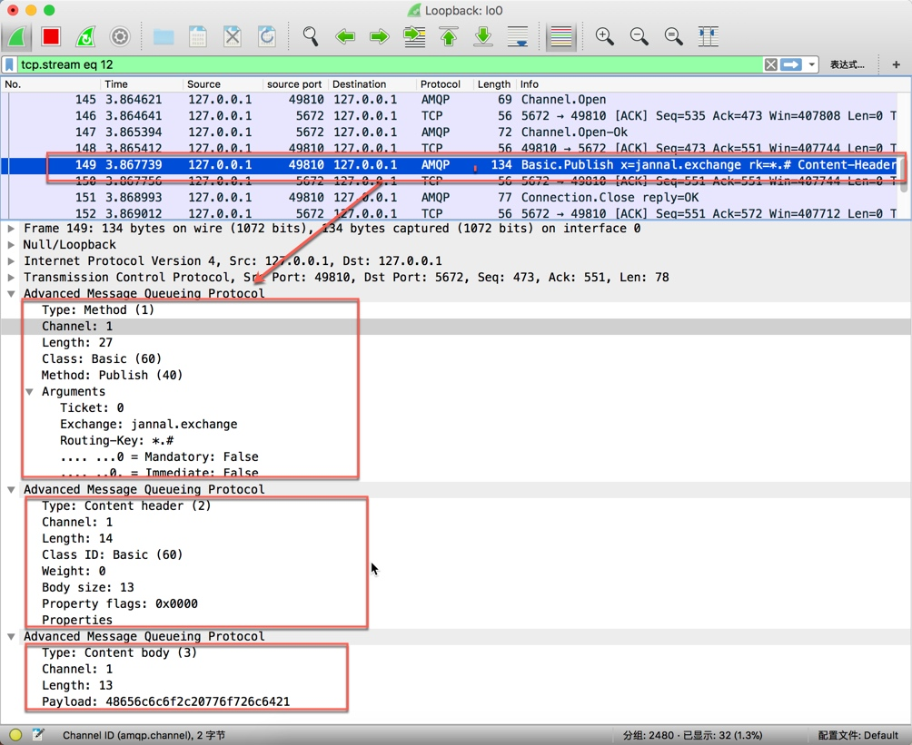

# 发布消息

## 步骤
1. 代码   
    
    ```java
    byte[] messageBodyBytes = "Hello, world!".getBytes();
    channel.basicPublish("jannal.exchange", "*.#", null, messageBodyBytes);

    ```
2. 抓包分析


3. 从抓包来看。上面代码一个Channel连续发送了三个Frame，分别是
    * Method(方法帧)
        * Type:方法帧
        * channel编号为1
        * length:27
        * Class是Basic
        * Method为Publish
        * Arguments为配置参数以及交换器和路由key
    * Content Header(内容头帧)
        * type:Content Header
        * channel编号为1
        * length为14
        * ClassID:Basic
        * weight:0
        * body size:13
        * property flags:0x0000
    * Content Body(内容体帧)
        * type:Content body
        * channel编号为1
        * payload:xxxx
    


