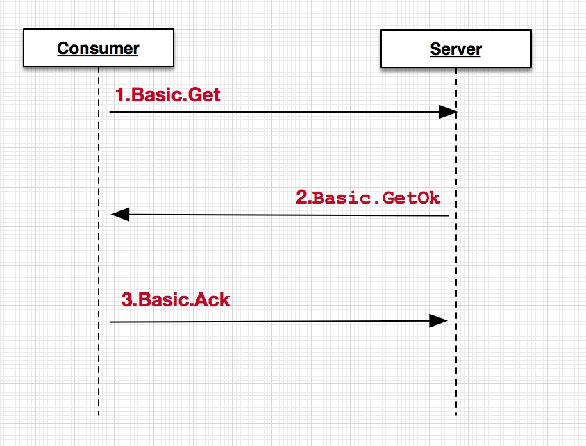
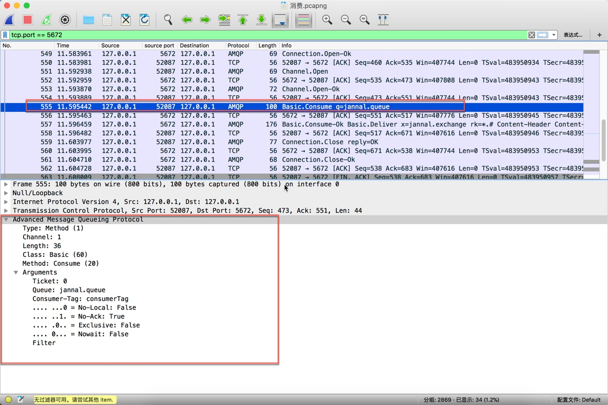

[TOC]


# 订阅消息
1. `RabbitMQ`的消费模式分为两种:`Push(推)`和`Pull(拉)`，`Push模式`采用`Basic.Consume`进行消费，而`Pull(拉)模式`是调用`Basic.Get`
2. 如果在一个Channel中维护多个消费者，如果Channel中的一个消费者一直运行，那么其他消费者的Callback调用会被阻塞。

## pull代码

1.`pull流程`
	
2. 代码
	
```java
		public class ConsumerGetTest {
		    public static void main(String[] args) {
		        String userName = "jannal";
		        String password = "jannal";
		        String virtualHost = "jannal-vhost";
		        String hostName = "jannal.mac.com";
		        int portNumber = 5672;
		        ConnectionFactory factory = new ConnectionFactory();
		        factory.setUsername(userName);
		        factory.setPassword(password);
		        factory.setVirtualHost(virtualHost);
		        factory.setHost(hostName);
		        factory.setPort(portNumber);
		        factory.setAutomaticRecoveryEnabled(false);
		
		        Connection conn = null;
		        try {
		            conn = factory.newConnection();
		
		
		            final Channel channel = conn.createChannel();
		
		            while (true) {
		                //Basic.get是拉消息,性能比Basic.Consume低，尽量避免使用,一般情况下获取单条可以使用，最好不要放到while循环中，否则会影响MQ的性能
		                GetResponse getResponse = channel.basicGet("jannal.queue", true);
		
		                if (getResponse != null) {
		                    byte[] body = getResponse.getBody();
		                    Envelope envelope = getResponse.getEnvelope();
		                    int messageCount = getResponse.getMessageCount();
		                    AMQP.BasicProperties props = getResponse.getProps();
		                    System.out.println(new String(body, "utf-8"));
		                } else {
		                    System.out.println("响应为空");
		                }
		            }
		
		
		        } catch (IOException e) {
		            e.printStackTrace();
		        } catch (TimeoutException e) {
		            e.printStackTrace();
		        } finally {
		            if (conn != null) {
		                try {
		                    conn.close();
		                } catch (IOException e) {
		                    e.printStackTrace();
		                }
		            }
		        }
		    }
		}
```

## Push代码

1. 代码
    
    ```java
    channel.basicConsume("jannal.queue",true,"consumerTag",new DefaultConsumer(channel){
                    @Override
                    public void handleDelivery(String consumerTag, Envelope envelope, AMQP.BasicProperties properties, byte[] body) throws IOException {
                        super.handleDelivery(consumerTag, envelope, properties, body);
                        String routingKey =envelope.getRoutingKey();
                        String contentType = properties.getContentType();
                        long deliveryTag =envelope.getDeliveryTag();
                        // (process the message components here ...)
                        ///channel.basicAck(deliveryTag, false);
                        System.out.print(new String(body,"utf-8"));
                    }
                });
    ```
2. 核心代码分析


# Consumer
1. 消费者接口，默认的实现类是`DefaultConsumer`,`DefaultConsumer`只有`Channel`和`consumerTag`以及一些空的实现，可以认为这是一个适配器，具体要做什么处理由调用方自己决定


## 抓包分析
1. `Basic.Consumer`


2. `Basic.Deliver`
    * 从下图可以看出`Rabbitmq Server`返回的协议格式为`[Method][Method][Content Header][Content body]`
    * 


    * 

    * 

## 核心方法分析
1. `basicConsume`
    
    ```java
    /**
     * 1.启动消费者，调用消费者的handlerConsumerOk
     * 2.queue 队列名称
     * 3. autoAck 自动ack
     * 4.consumerTag 不同的订阅采用Consumer Tag作为区分，在同一个Channel中的Consumer也需要通过唯一的Consumer tag以区分
     * 5. Consumer 回调接口
     */
    /** Public API - {@inheritDoc} */
    @Override
    public String basicConsume(String queue, final boolean autoAck, String consumerTag,
                               boolean noLocal, boolean exclusive, Map<String, Object> arguments,
                               final Consumer callback)
        throws IOException
    {
        //Future泛型对象是一个actualConsumerTag
        BlockingRpcContinuation<String> k = new BlockingRpcContinuation<String>() {
            @Override
            public String transformReply(AMQCommand replyCommand) {
                String actualConsumerTag = ((Basic.ConsumeOk) replyCommand.getMethod()).getConsumerTag();
                //保存consumerTag与Consumer的关联
                _consumers.put(actualConsumerTag, callback);

                // need to register consumer in stats before it actually starts consuming
                metricsCollector.basicConsume(ChannelN.this, actualConsumerTag, autoAck);

                //分发器，启动线程进行消费
                dispatcher.handleConsumeOk(callback, actualConsumerTag);
                return actualConsumerTag;
            }
        };

        rpc(new Basic.Consume.Builder()
             .queue(queue)
             .consumerTag(consumerTag)
             .noLocal(noLocal)
             .noAck(autoAck)
             .exclusive(exclusive)
             .arguments(arguments)
            .build(),
            k);

        try {
            return k.getReply();
        } catch(ShutdownSignalException ex) {
            throw wrap(ex);
        }
    }    
    
    ```
    
2. `rpc`分析
    * `quiescingRpc`
    
        ```java
          public void quiescingRpc(Method m, RpcContinuation k)
            throws IOException
        {
            //通道互斥锁,enqueueRpc和quiescingTransmit也加互斥锁
            synchronized (_channelMutex) {
                enqueueRpc(k);
                quiescingTransmit(m);
            }
        }
    
        ```
    * `enqueueRpc`
        
        ```java
         public void enqueueRpc(RpcContinuation k)
        {
            synchronized (_channelMutex) {
                boolean waitClearedInterruptStatus = false;
                //如果不为空此时等待，在nextOutstandingRpc时恢复初始状态null
                while (_activeRpc != null) {
                    try {
                        _channelMutex.wait();
                    } catch (InterruptedException e) {
                        waitClearedInterruptStatus = true;
                    }
                }
                if (waitClearedInterruptStatus) {
                    Thread.currentThread().interrupt();
                }
                _activeRpc = k;
            }
        }
        ```
    
    * `quiescingTransmit`
    
        ```java
        public void quiescingTransmit(Method m) throws IOException {
            synchronized (_channelMutex) {
                quiescingTransmit(new AMQCommand(m));
            }
        }

        public void quiescingTransmit(AMQCommand c) throws IOException {
            synchronized (_channelMutex) {
                if (c.getMethod().hasContent()) {
                    while (_blockContent) {
                        try {
                            _channelMutex.wait();
                        } catch (InterruptedException ignored) {}
    
                        // This is to catch a situation when the thread wakes up during
                        // shutdown. Currently, no command that has content is allowed
                        // to send anything in a closing state.
                        ensureIsOpen();
                    }
                }
                c.transmit(this);
            }
        }
        ```

