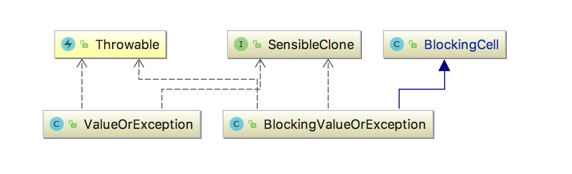

[TOC]

# BlockingCell
1. `BlockingCell`代码文档描述为”简单的一次性IPC机制“，个人认为是一个`Future`对象，大多数长连接里异步处理获取响应值都会采用`Future`模式。
2. 源码中文注释[BlockingCell](../rabbitmq-java-client/src/main/java/com/rabbitmq/utility/BlockingCell.java)
3. uml关联
   
   

## BlockingCell源码分析
 1. 完整代码，我们从代码结构来看其实就是一个Future  
   
    ```java
    /**
     * Simple one-shot IPC mechanism. Essentially a one-place buffer that cannot be emptied once filled.
     * 简单的一次性IPC机制。 基本上是一个缓冲区，一旦填满就不能清空。
     * 从代码上来看其实就是一个Future对象
     */
    public class BlockingCell<T> {
        /** Indicator of not-yet-filledness
         *  尚未填充满的标示
         * */
        private boolean _filled = false;
    
        /** Will be null until a value is supplied, and possibly still then. */
        private T _value;
    
        private static final long NANOS_IN_MILLI = 1000 * 1000;
    
        private static final long INFINITY = -1;
    
        /** Instantiate a new BlockingCell waiting for a value of the specified type. */
        public BlockingCell() {
            // no special handling required in default constructor
        }
    
        /**
         * Wait for a value, and when one arrives, return it (without clearing it). If there's already a value present, there's no need to wait - the existing value
         * is returned.
         * 一直等待，直到拿到响应数据之后调用set(T newValue)，设置值之后调用notifyAll()，此时get()不再阻塞。
         * @return the waited-for value
         *
         * @throws InterruptedException if this thread is interrupted
         */
        public synchronized T get() throws InterruptedException {
            while (!_filled) {
                wait();
            }
            return _value;
        }
    
        /**
         * Wait for a value, and when one arrives, return it (without clearing it). If there's
         * already a value present, there's no need to wait - the existing value is returned.
         * If timeout is reached and value hasn't arrived, TimeoutException is thrown.
         * 
         * @param timeout timeout in milliseconds. -1 effectively means infinity
         * @return the waited-for value
         * @throws InterruptedException if this thread is interrupted
         */
        public synchronized T get(long timeout) throws InterruptedException, TimeoutException {
            //如果设置为-1，则表示一直等待下去
            if (timeout == INFINITY) return get();
    
            if (timeout < 0) {
                throw new AssertionError("Timeout cannot be less than zero");
            }
    
            long now = System.nanoTime() / NANOS_IN_MILLI;
            long maxTime = now + timeout;
            while (!_filled && (now = (System.nanoTime() / NANOS_IN_MILLI)) < maxTime) {
                wait(maxTime - now);
            }
    
            if (!_filled)
                throw new TimeoutException();
    
            return _value;
        }
    
        /**
         * As get(), but catches and ignores InterruptedException, retrying until a value appears.
         * @return the waited-for value
         */
        public synchronized T uninterruptibleGet() {
            boolean wasInterrupted = false;
            try {
                while (true) {
                    try {
                        return get();
                    } catch (InterruptedException ex) {
                        // no special handling necessary
                        wasInterrupted = true;
                    }
                }
            } finally {
                if (wasInterrupted) {
                    Thread.currentThread().interrupt();
                }
            }
        }
    
        /**
         * As get(long timeout), but catches and ignores InterruptedException, retrying until
         * a value appears or until specified timeout is reached. If timeout is reached,
         * TimeoutException is thrown.
         * We also use System.nanoTime() to behave correctly when system clock jumps around.
         * 
         * @param timeout timeout in milliseconds. -1 means 'infinity': never time out
         * @return the waited-for value
         */
        public synchronized T uninterruptibleGet(int timeout) throws TimeoutException {
            long now = System.nanoTime() / NANOS_IN_MILLI;
            long runTime = now + timeout;
            boolean wasInterrupted = false;
            try {
                do {
                    try {
                        return get(runTime - now);
                    } catch (InterruptedException e) {
                        // Ignore.
                        wasInterrupted = true;
                    }
                } while ((timeout == INFINITY) || ((now = System.nanoTime() / NANOS_IN_MILLI) < runTime));
            } finally {
                if (wasInterrupted) {
                    Thread.currentThread().interrupt();
                }
            }
    
            throw new TimeoutException();
        }
    
        /**
         * Store a value in this BlockingCell, throwing AssertionError if the cell already has a value.
         *
         * @param newValue the new value to store
         */
        public synchronized void set(T newValue) {
            if (_filled) {
                throw new AssertionError("BlockingCell can only be set once");
            }
            _value = newValue;
            _filled = true;
            notifyAll();
        }
    
        /**
         * Store a value in this BlockingCell if it doesn't already have a value.
         * @return true if this call to setIfUnset actually updated the BlockingCell; false if the cell already had a value.
         * @param newValue the new value to store
         */
        public synchronized boolean setIfUnset(T newValue) {
            if (_filled) {
                return false;
            }
            set(newValue);
            return true;
        }
    }

    ```

## ValueOrException
1. `ValueOrException`值与异常的包装。
    
    ```java
    public class ValueOrException<V, E extends Throwable & SensibleClone<E>> {
        private final boolean _useValue;
        private final V _value;
        private final E _exception;
        ......
    }

    ```
    
## BlockingValueOrException

1. `BlockingValueOrException`是`BlockingCell`的扩展类，泛型参数是`ValueOrException`

    ```java
    public class BlockingValueOrException<V, E extends Throwable & SensibleClone<E>>
        extends BlockingCell<ValueOrException<V, E>>
    {
        public void setValue(V v) {
            super.set(ValueOrException.<V, E>makeValue(v));
        }
    
        public void setException(E e) {
            super.set(ValueOrException.<V, E>makeException(e));
        }
    
        public V uninterruptibleGetValue() throws E {
            return uninterruptibleGet().getValue();
        }
    
        public V uninterruptibleGetValue(int timeout) throws E, TimeoutException {
        	return uninterruptibleGet(timeout).getValue();
        }
    }
    ```
    
# 扩展

## 自己写一个
1. 这里是我之前学习netty时候写的一个Future对象以及实现，供参考
2. `ResponseFuture接口`
   
    ```java
    public interface ResponseFuture<T> {
    
        T get()  throws InterruptedException;
    
        T get(final long timeoutMillis)  throws InterruptedException;
        
        boolean isCancelled();
    
        boolean isDone();
    
        boolean isSuccess();
    
        void setResult(T result);
    
        void setFailure(Throwable err);
    
        boolean isTimeout();
        
        public long getCreateTime();
    
        public long getTimeoutInMillis();
        
        public void executeAsyncInvokeCallback();
        
        public void setAsyncInvokeCallback(AsyncInvokeCallback<T> invokeCallback);
        
        public boolean hasCallback();
    }
    ```  
    
3. `AbstractResponseFuture抽象类`
    
    ```java
    package cn.jananl.netty.transport;
    
    import java.util.concurrent.CountDownLatch;
    public abstract class AbstractResponseFuture<T> implements ResponseFuture<T>{
    
        public enum FutureState {
            /**新建任务 **/
            NEW(0),
            /** 任务完成 **/
            DONE(1),
            /** 任务取消**/
            CANCELLED(2),
            /**
             * 任务超时
             */
            TIMEOUT(3);
            private int state;
            FutureState(int state) {
                this.state = state;
            }
        }
        protected final CountDownLatch countDownLatch = new CountDownLatch(1);
        
        
        protected volatile FutureState state = FutureState.NEW; //状态
        
        protected final long createTime = System.currentTimeMillis();//处理开始时间
    
        /**
         * 本地调用的超时时间
         */
        protected long timeoutInMillis;
    
        public AbstractResponseFuture(long timeoutInMillis) {
            this.timeoutInMillis = timeoutInMillis;
        }
    
        @Override
        public boolean isCancelled() {
            return this.state == FutureState.CANCELLED;
        }
    
        @Override
        public boolean isDone() {
            return this.state == FutureState.DONE;
        }
    
        @Override
        public boolean isTimeout() {
            return createTime + timeoutInMillis < System.currentTimeMillis();
        }
    
        public long getCreateTime() {
            return createTime;
        }
    
        public long getTimeoutInMillis() {
            return timeoutInMillis;
        }
    }
    ``` 
    
4. `DefaultResponseFuture`具体实现
    
    ```java
    package cn.jananl.netty.transport;
    
    import java.util.concurrent.TimeUnit;
    /**
     * 默认响应future
     * @author jannal
     * @param <T>
     */
    public class DefaultResponseFuture<T> extends AbstractResponseFuture<T>{
    
        private volatile T result;
        private volatile Throwable throwable;
        private  AsyncInvokeCallback<T> invokeCallback;
        
        public DefaultResponseFuture(long timeoutInMillis) {
            super(timeoutInMillis);
        }
    
        @Override
        public T get() throws InterruptedException {
            if(!this.isDone()) {
                this.countDownLatch.await(super.timeoutInMillis, TimeUnit.MILLISECONDS);
            }
            if(this.throwable!=null){
                if(this.state==FutureState.CANCELLED){
                    throw new RuntimeException("任务被取消");
                }else{
                    throw new RuntimeException(this.throwable);
                }
            }else{
                return this.result;
            }
           
        }
    
        @Override
        public T get(long timeout) throws InterruptedException {
            if(!this.isDone()) {
                this.countDownLatch.await(timeout, TimeUnit.MILLISECONDS);
            }
            return result; 
        }
    
        @Override
        public boolean isSuccess() {
            return isDone()&&throwable==null;
        }
    
    
        @Override
        public void setFailure(Throwable cause) {
            if(!this.isDone()) {
                this.setFailure(cause);
                this.state = FutureState.DONE;
                this.countDownLatch.countDown();
            }
        }
    
        @Override
        public void setResult(T result) {
            if(!this.isDone()){
                this.result = result;
                this.state = FutureState.DONE;
                this.countDownLatch.countDown();
            }
            
        }
    
        @Override
        public void executeAsyncInvokeCallback() {
            if(invokeCallback!=null){
                invokeCallback.operationComplete(this);
            }
            
        }
    
        @Override
        public void setAsyncInvokeCallback(AsyncInvokeCallback<T> invokeCallback) {
           this.invokeCallback =  invokeCallback;
            
        }
    
        @Override
        public boolean hasCallback() {
            if(invokeCallback!=null){
                return true;
            }
            return false;
        }
    }
    ```
    

 


