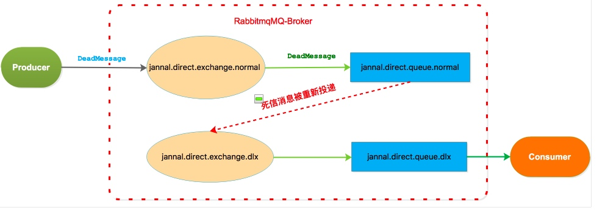
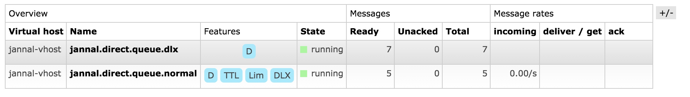
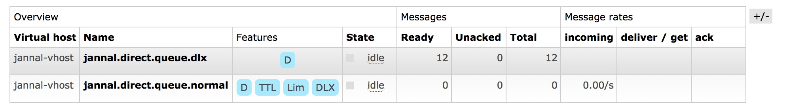
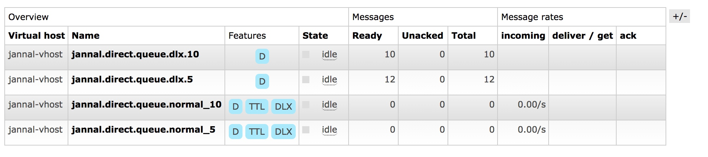

[TOC]

# 死信队列

1. 死信队列(`DLQ(Dead-Letter-Queue)`)用来保存处理失败或者过期的消息。当一个消息变为死信消息(`Dead Message`)之后,消息会被投递到死信交换器(`DLX(Dead-Letter-Exchange)`)中，`DLX`会将消息投递到死信队列(`DLQ`)中
2. 消息变为死信消息的情况
    * 消息没有被正确消费————被取消确认(`Basic.Nack`或者`Basic.Reject`),并且设置`requeue`参数为false；
    * 消息TTL过期
    * 队列达到最大长度
3. 死信交换器(`DLX(Dead-Letter-Exchange)`)就是普通的`Exchange`.RabbitMQ 不会去验证死信交换器(`DLX(Dead-Letter-Exchange)`)设置是否有效，当死信消息找不到指定的交换器时，死信消息会被RabbitMQ安静的丢弃，而不是抛出异常。

4. 当在某一个队列中设置`x-dead-letter-exchange`属性时，如果这个队列中有消息变为死信消息，则`Broker`会自动的将这个消息重新发布到设置的`Exchange`上(`x-dead-letter-exchange`对应的那个交换器)。
      


5. 代码示例
    
    ```java
  /**
     * 死信队列
     */
    @Test
    public void testDLX() {
        ConnectionFactory factory = new ConnectionFactory();

        String userName = "jannal";
        String password = "jannal";
        String virtualHost = "jannal-vhost";
        String dlxQueueName = "jannal.direct.queue.dlx";
        String queueNameNormal = "jannal.direct.queue.normal";
        String dlxExchange = "jannal.direct.exchange.dlx";
        String exchangeNormal = "jannal.direct.exchange.normal";
        String routingKey = "DeadMessage";
        String bindingKey = "DeadMessage";
        String hostName = "jannal.mac.com";
        int portNumber = 5672;

        factory.setUsername(userName);
        factory.setPassword(password);
        factory.setVirtualHost(virtualHost);
        factory.setHost(hostName);
        factory.setPort(portNumber);
        factory.setAutomaticRecoveryEnabled(false);

        Connection conn = null;
        try {
            conn = factory.newConnection();
            Channel channel = conn.createChannel();
            boolean durable = true;
            boolean exclusive = false;
            boolean autoDelete = false;


            //普通队列添加DLX
            HashMap<String, Object> queueArgs = new HashMap<>();
            queueArgs.put("x-dead-letter-exchange", dlxExchange);
            //如果不为DLX执行routingKey，则使用原来队列的
            //args.put("x-dead-letter-routing-key","dlx");
            queueArgs.put("x-message-ttl", 10000); // 设置队列中消息存活时间为10秒
            queueArgs.put("x-max-length", 5); // 设置队列最大消息数量为5
            channel.queueDeclare(queueNameNormal, durable, exclusive, autoDelete, queueArgs);
            channel.exchangeDeclare(exchangeNormal, "direct", true);
            channel.queueBind(queueNameNormal, exchangeNormal, bindingKey);

            //死信
            channel.queueDeclare(dlxQueueName, durable, exclusive, autoDelete,null);
            channel.exchangeDeclare(dlxExchange, "direct", true);
            channel.queueBind(dlxQueueName, dlxExchange, bindingKey);

            boolean mandatory = false;
            boolean immediate = false;
            String msg = "Hello, world ";
            for (int i = 0; i < 12; i++) {
                channel.basicPublish(exchangeNormal,
                        routingKey,
                        mandatory,
                        immediate,
                        MessageProperties.PERSISTENT_TEXT_PLAIN,
                        msg.getBytes("UTF-8"));
            }

        } catch (IOException e) {
            logger.error(e.getMessage(), e);
        } catch (TimeoutException e) {
            logger.error(e.getMessage(), e);
        } finally {
            if (conn != null) {
                try {
                    conn.close();
                } catch (IOException e) {
                    e.printStackTrace();
                }
            }
        }
    }
    
    ```
    
6. 查看web控制台,`Lim`表示`x-max-length=5`,`D`表示`durable=true`,`TTL`表示`x-message-ttl=10000`,`DLX`表示`x-dead-letter-exchange=jannal.direct.exchange.dlx`。 因为队列最大长度为5，所以发送12条消息其中5条是进入`jannal.direct.queue.normal`,其中7条被放入到`jannal.direct.queue.dlx`死信队列中。当普通队列中的5条消息10s后过期时，此时12条消息都被投递到死信队列中
    
    

# 延迟队列

1. 延迟队列存储的是延迟的消息，即`consumer(消费者)`只有在等待特定的时间后才能去消费消息或者看到消息。
2. 延迟消息应用场景
    * 一个A任务执行之后，等待特定的时间T，B任务才能去执行。比如用户买火车票，必须在30分钟以内支付，否则席位会被取消。此时【取消席位】这个任务就可以使用延迟队列来处理。再比如滴滴打车之后，用户一直不评价，24小时之后自动评价
3. `x-message-ttl`设置队列中消息的存活时间，当消息过期变为死信队列之后，此时`Consumer(消息者)`就可以从死信队列中消费消息，这样就达到了延迟特定时间的目的了。

4. 为不同的延迟时间设置不同的队列，代码示例
    
    ```java
     /**
         * 延迟队列
         */
        @Test
        public void testDelayQueue() {
            ConnectionFactory factory = new ConnectionFactory();
    
            String userName = "jannal";
            String password = "jannal";
            String virtualHost = "jannal-vhost";
            String dlxQueueName_5 = "jannal.direct.queue.dlx.5";
            String dlxQueueName_10 = "jannal.direct.queue.dlx.10";
            String queueNameNormal_5 = "jannal.direct.queue.normal_5";
            String queueNameNormal_10 = "jannal.direct.queue.normal_10";
            String dlxExchange_5 = "jannal.direct.exchange.dlx_5";
            String dlxExchange_10 = "jannal.direct.exchange.dlx_10";
            String exchangeNormal = "jannal.direct.exchange.normal";
    
            String hostName = "jannal.mac.com";
            int portNumber = 5672;
    
            factory.setUsername(userName);
            factory.setPassword(password);
            factory.setVirtualHost(virtualHost);
            factory.setHost(hostName);
            factory.setPort(portNumber);
            factory.setAutomaticRecoveryEnabled(false);
    
            Connection conn = null;
            try {
                conn = factory.newConnection();
                Channel channel = conn.createChannel();
                boolean durable = true;
                boolean exclusive = false;
                boolean autoDelete = false;
    
                HashMap<String, Object> queueArgs = new HashMap<>();
                queueArgs.put("x-dead-letter-exchange", dlxExchange_5);
    
                //设置5s
                queueArgs.put("x-message-ttl", 5);
                channel.queueDeclare(queueNameNormal_5, durable, exclusive, autoDelete, queueArgs);
                channel.exchangeDeclare(exchangeNormal, "direct", true);
                channel.queueBind(queueNameNormal_5, exchangeNormal, "5s");
                //设置10s
                queueArgs.put("x-dead-letter-exchange", dlxExchange_10);
                queueArgs.put("x-message-ttl", 10);
                channel.queueDeclare(queueNameNormal_10, durable, exclusive, autoDelete, queueArgs);
                channel.exchangeDeclare(exchangeNormal, "direct", true);
                channel.queueBind(queueNameNormal_10, exchangeNormal, "10s");
    
                //死信
                channel.queueDeclare(dlxQueueName_5, durable, exclusive, autoDelete,null);
                channel.exchangeDeclare(dlxExchange_5, "direct", true);
                channel.queueBind(dlxQueueName_5, dlxExchange_5, "5s");
    
                channel.queueDeclare(dlxQueueName_10, durable, exclusive, autoDelete,null);
                channel.exchangeDeclare(dlxExchange_10, "direct", true);
                channel.queueBind(dlxQueueName_10, dlxExchange_10, "10s");
    
    
                boolean mandatory = false;
                boolean immediate = false;
                String msg = "Hello, world ";
                //过期时间5s的12条
                for (int i = 0; i < 12; i++) {
                    channel.basicPublish(exchangeNormal,
                            "5s",
                            mandatory,
                            immediate,
                            MessageProperties.PERSISTENT_TEXT_PLAIN,
                            msg.getBytes("UTF-8"));
                }
    
                //过期时间10s的10条
                for (int i = 0; i < 10; i++) {
                    channel.basicPublish(exchangeNormal,
                            "10s",
                            mandatory,
                            immediate,
                            MessageProperties.PERSISTENT_TEXT_PLAIN,
                            msg.getBytes("UTF-8"));
                }
    
            } catch (IOException e) {
                logger.error(e.getMessage(), e);
            } catch (TimeoutException e) {
                logger.error(e.getMessage(), e);
            } finally {
                if (conn != null) {
                    try {
                        conn.close();
                    } catch (IOException e) {
                        e.printStackTrace();
                    }
                }
            }
        }
    
    
    
    ```
    
5. web控制台查看
    

        
    

