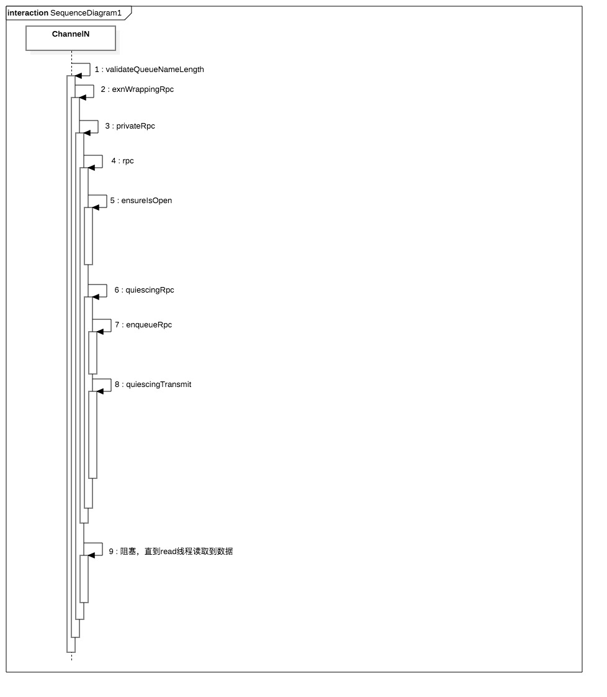
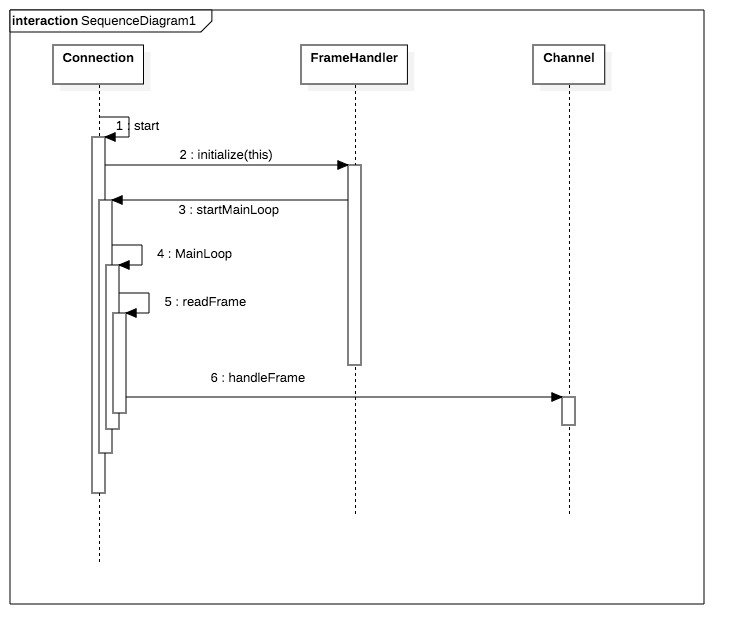

[TOC]


# 声明

1. Queue声明、exchange声明、绑定等，这些都是通过同步调用

    ```java
    
              
                channel.queueDeclare(queueName, durable, exclusive, autoDelete, null);
                channel.exchangeDeclare(exchange, "direct", true);  
                channel.queueBind(queueName, exchange, bindingKey);
    ```


## 发送数据

1. `queueDeclare`:声明队列，调用的方法嵌套比较多



2. 核心调用流程

3. `validateQueueNameLength`:从这里可以看到，队列名字的长度最大为255
    
    ```java
        private static void validateQueueNameLength(String queue) {
            if(queue.length() > 255) {
               throw new IllegalArgumentException("queue name must be no more than 255 characters long");
            }
        }
    
    ```
4. `privateRpc`:创建Future对象，调用rpc方法发送数据给服务端。`k.getReply()`阻塞等待直到`connection.startMainLoop()`启动的读线程读取到服务端返回的数据为止。
    
    ```java
        private AMQCommand privateRpc(Method m)
            throws IOException, ShutdownSignalException
        {
            //封装BlockingValueOrException
            SimpleBlockingRpcContinuation k = new SimpleBlockingRpcContinuation();
            rpc(m, k);
            // At this point, the request method has been sent, and we
            // should wait for the reply to arrive.
            //
            // Calling getReply() on the continuation puts us to sleep
            // until the connection's reader-thread throws the reply over
            // the fence.
            return k.getReply();
        }
        
        public void rpc(Method m, RpcContinuation k)
        throws IOException {
            synchronized (_channelMutex) {
                ensureIsOpen();
                quiescingRpc(m, k);
            }
        }
        
        public void quiescingRpc(Method m, RpcContinuation k)
        throws IOException {
            //通道互斥锁
            synchronized (_channelMutex) {
                enqueueRpc(k);
                quiescingTransmit(m);
            }
        }
    
    ```
5. `enqueueRpc`:入队RPC，赋值给_activeRpc(_activeRpc变量表示未完成的RPC)，如果当前还有未完成的RPC请求，则等待直到完成才继续。`connection.startMainLoop()`单独线程读取从服务端响应的数据，一旦有数据，`_activeRpc`会被赋值

    ```java
        public void enqueueRpc(RpcContinuation k)
        {
            synchronized (_channelMutex) {
                
                boolean waitClearedInterruptStatus = false;
                //_activeRpc表示的是当前未完成的RPC请求，如果不为空，则一直等待
                while (_activeRpc != null) {
                    try {
                        _channelMutex.wait();
                    } catch (InterruptedException e) {
                        //为什么不直接在这里调用重置中断状态??加个变量不是多此一举吗？
                        waitClearedInterruptStatus = true;
                    }
                }
                
                if (waitClearedInterruptStatus) {
                    Thread.currentThread().interrupt();
                }
                _activeRpc = k;
            }
        }
    
    
    ```
6. `quiescingTransmit()`:委托AMQCommand传输
    
    ```java
    
        //每一次调用都是new AMQCommand()
        public void quiescingTransmit(Method m) throws IOException {
        synchronized (_channelMutex) {
            quiescingTransmit(new AMQCommand(m));
        }
    }
        public void quiescingTransmit(AMQCommand c) throws IOException {
                synchronized (_channelMutex) {
                    if (c.getMethod().hasContent()) {
                        while (_blockContent) {
                            try {
                                _channelMutex.wait();
                            } catch (InterruptedException ignored) {}
        
                            // This is to catch a situation when the thread wakes up during
                            // shutdown. Currently, no command that has content is allowed
                            // to send anything in a closing state.
                            ensureIsOpen();
                        }
                    }
                    c.transmit(this);
                }
            }
    ```
    
    
## 读取响应数据分析

1. 流程


2. ` connection.startMainLoop();`

    ```java
        /**
         * 循环从TCP连接中读取输入流，如果没有就阻塞等待
         */
        private class MainLoop implements Runnable {
    
            /**
             * Channel reader thread main loop. Reads a frame, and if it is
             * not a heartbeat frame, dispatches it to the channel it refers to.
             * Continues running until the "running" flag is set false by
             * shutdown().
             */
            @Override
            public void run() {
                try {
                    while (_running) {
                        Frame frame = _frameHandler.readFrame();
                            readFrame(frame);
                    }
                } catch (Throwable ex) {
                    handleFailure(ex);
                } finally {
                    doFinalShutdown();
                }
            }
        }    
          private void readFrame(Frame frame) throws IOException {
            if (frame != null) {
                _missedHeartbeats = 0;
                if (frame.type == AMQP.FRAME_HEARTBEAT) {
                    // Ignore it: we've already just reset the heartbeat counter.
                } else {
                    // 0号Channel表示Connection全局连接(即TCP连接)中的所有Frame，1-65535表示的是特定Channel的帧
                    if (frame.channel == 0) { // the special channel
                        _channel0.handleFrame(frame);
                    } else {
                        if (isOpen()) {
                            // If we're still _running, but not isOpen(), then we
                            // must be quiescing, which means any inbound frames
                            // for non-zero channels (and any inbound commands on
                            // channel zero that aren't Connection.CloseOk) must
                            // be discarded.
                            ChannelManager cm = _channelManager;
                            if (cm != null) {
                                ChannelN channel;
                                try {
                                    channel = cm.getChannel(frame.channel);
                                } catch(UnknownChannelException e) {
                                    // this can happen if channel has been closed,
                                    // but there was e.g. an in-flight delivery.
                                    // just ignoring the frame to avoid closing the whole connection
                                    LOGGER.info("Received a frame on an unknown channel, ignoring it");
                                    return;
                                }
                                channel.handleFrame(frame);
                            }
                        }
                    }
                }
            } else {
                // Socket timeout waiting for a frame.
                // Maybe missed heartbeat.
                handleSocketTimeout();
            }
        }
    ```
  
3. ` channel.handleFrame(frame)`:获取服务端响应的Frame，并将结果赋值给Future的value
    
    ```java
      public void handleFrame(Frame frame) throws IOException {
            AMQCommand command = _command;
            if (command.handleFrame(frame)) { // a complete command has rolled off the assembly line
                _command = new AMQCommand(); // prepare for the next one
                handleCompleteInboundCommand(command);
            }
        }
      public void handleCompleteInboundCommand(AMQCommand command) throws IOException {
            // First, offer the command to the asynchronous-command
            // handling mechanism, which gets to act as a filter on the
            // incoming command stream.  If processAsync() returns true,
            // the command has been dealt with by the filter and so should
            // not be processed further.  It will return true for
            // asynchronous commands (deliveries/returns/other events),
            // and false for commands that should be passed on to some
            // waiting RPC continuation.
            if (!processAsync(command)) {
                // The filter decided not to handle/consume the command,
                // so it must be some reply to an earlier RPC.
                RpcContinuation nextOutstandingRpc = nextOutstandingRpc();
                // the outstanding RPC can be null when calling Channel#asyncRpc
                if(nextOutstandingRpc != null) {
                    //读完服务端响应的Frame，给Future赋值 
                    nextOutstandingRpc.handleCommand(command);
                    markRpcFinished();
                }
            }
        }   
        
    
    ```