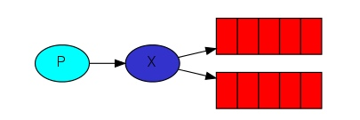
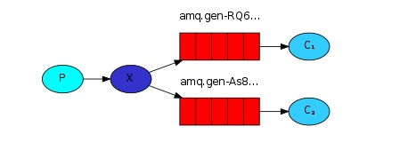
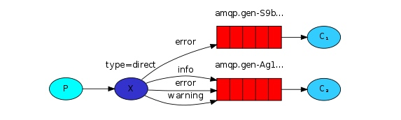
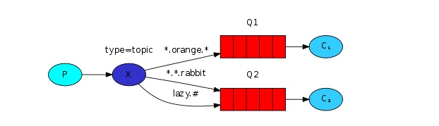
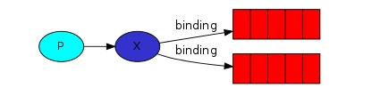

[TOC]

<!-- toc -->

# rabbit
1. 参考 https://mp.weixin.qq.com/s/OABseRR0BnbK9svIPyLKXw

## rabbit 基本概念
1. RabbitMQ是一个Erlang开发的AMQP（Advanced Message Queuing Protocol ）的开源实现.
2. Connection Factory、Connection、Channel都是RabbitMQ对外提供的API中最基本的对象。Connection是RabbitMQ的socket链接，它封装了socket协议相关部分逻辑。Connection Factory则是Connection的制造工厂。

### Queue
1. Queue（队列）是RabbitMQ的内部对象，用于存储消息。RabbitMQ中的消息都只能存储在Queue中

### Message acknowledgment
1. 消息回执。
	* 消费者受到Queue中的消息，但没有处理完成就宕机(或者其他情况)，这种情况会导致消息丢失，为了避免这个问题，可以要求消费者在处理完消息之后发送一个ack(回执)给rabbitmq。rabbitmq收到消息回执之后才将消息从Queue中移除。
	* 如果没有收到消息回执并检测到消费者的rabbitmq连接断开，则rabbitmq会将消息发送给其他消费者进行处理。这里不存在timeout，一个消费者处理消息时间再长也不会导致该消息被发送给其他消息者，除非他的rabbitmq连接断开。  
	* 如果我们的开发人员在处理完业务逻辑后，忘记发送回执给RabbitMQ，这将会导致严重的bug——Queue中堆积的消息会越来越多。消费者重启后会重复消费这些消息并重复执行业务逻辑。
2. publish message 是没有ACK的。

### Message durability
1. 可以将Queue与Message 都设置为可持久化的（durable），这样可以保证绝大部分情况下我们的rabbitmq消息不会丢失(加入还没来及的持久化就宕机则依然会丢失)

### Prefetch count
1. 如果多个消费者同时订阅同一个Queue中的消息，Queue中的消息会被平摊给多个消费者，如果每个消息的处理时间不同，就可能导致一些消费者一直在忙，而另外一些消费者一直在空闲。可以通过设置Prefetch count来限制Queue每次发送给每个消费者的消息数，比如设置为1，则Queue每次给每个消费者发送一条消息，消费者处理完这条消息后Queue会再给该消费者发送一条消息。

## Exchange
1. 实际上生产者会将消息发送给Exchange(交换器)，由Exchange将消息路由到一个或者多个Queue(或者丢弃)


### Exchange的类型

#### fanout
1. 会把所有发送到该Exchange的消息路由到所有与它绑定的Queue中。下图中，生产者（P）发送到Exchange（X）的所有消息都会路由到图中的两个Queue，并最终被两个消费者（C1与C2）消费。


#### direct
1. 会把消息路由到那些Binding key与Routing key完全匹配的Queue中。
 
2. 以上图的配置为例，我们以routingKey="error"发送消息到Exchange，则消息会路由到Queue1（amqp.gen-S9b…，这是由RabbitMQ自动生成的Queue名称）和Queue2（amqp.gen-Agl…）；如果我们以Routing Key="info"或routingKey="warning"来发送消息，则消息只会路由到Queue2。如果我们以其他Routing Key发送消息，则消息不会路由到这两个Queue中。

#### topic
1. topic类型的Exchange在匹配规则上进行了扩展，它与direct类型的Exchage相似，也是将消息路由到Binding Key与Routing Key相匹配的Queue中，但这里的匹配规则有些不同，它约定：Routing Key为一个句点号“.”分隔的字符串（我们将被句点号". "分隔开的每一段独立的字符串称为一个单词），如"stock.usd.nyse"、"nyse.vmw"、"quick.orange.rabbit"。Binding Key与Routing Key一样也是句点号“. ”分隔的字符串。
2. Binding Key中可以存在两种特殊字符"*"与"#"，用于做模糊匹配，其中"*"用于匹配一个单词，"#"用于匹配多个单词（可以是零个）。
3. 图示 
	* 
	* 以上图中的配置为例，routingKey=”quick.orange.rabbit”的消息会同时路由到Q1与Q2，routingKey=”lazy.orange.fox”的消息会路由到Q1，routingKey=”lazy.brown.fox”的消息会路由到Q2，routingKey=”lazy.pink.rabbit”的消息会路由到Q2（只会投递给Q2一次，虽然这个routingKey与Q2的两个bindingKey都匹配）；routingKey=”quick.brown.fox”、routingKey=”orange”、routingKey=”quick.orange.male.rabbit”的消息将会被丢弃，因为它们没有匹配任何bindingKey。


## Routing Key。
	1. 生产者将消息发送给Exchange，一般会指定一个Routing Key，来指定这个消息的路由规则，而这个Routing Key需要与Exchange Type及Binding key联合使用才能生效。
	2. 在Exchange Type与Binding key固定的情况下（在正常使用时一般这些内容都是固定配置好的），我们的生产者就可以在发送消息给Exchange时，通过指定Routing Key来决定消息流向哪里。
	3. RabbitMQ为Routing Key设定的长度限制为255 bytes。
	
## Binding
1. RabbitMQ中通过Binding将Exchange与Queue关联起来，这样RabbitMQ就知道如何正确地将消息路由到指定的Queue了。

	

## Binding key
1. 在绑定（Binding）Exchange与Queue的同时，一般会指定一个Binding key。消费者将消息发送给Exchange时，一般会指定一个Routing Key。当Binding key与Routing Key相匹配时，消息将会被路由到对应的Queue中
2. 在绑定多个Queue到同一个Exchange的时候，这些Binding允许使用相同的Binding key。
3. Binding key并不是在所有情况下都生效，它依赖于Exchange Type，比如fanout类型的Exchange就会无视Binding key，而是将消息路由到所有绑定到该Exchange的Queue。	

## Virtual hosts
1. 每个virtual host本质上都是一个RabbitMQ Server，拥有它自己的queue，exchagne，和bings rule等等。这保证了你可以在多个不同的Application中使用RabbitMQ。


	  
## 安装
1. 安装
	
	```
	参考https://store.docker.com/images/rabbitmq
	docker run -d --hostname mac.rabbit --name mac-rabbit rabbitmq:3
	docker run -d --hostname mac.rabbit --name mac-rabbit -p 11111:15672 rabbitmq:3-management
	http://localhost:11111访问 用户名和密码都是guest
	
	docker run -d --name rabbitmq --publish 5671:5671 \
 --publish 5672:5672 --publish 4369:4369 --publish 25672:25672 --publish 15671:15671 --publish 15672:15672 \
rabbitmq:management
	```

